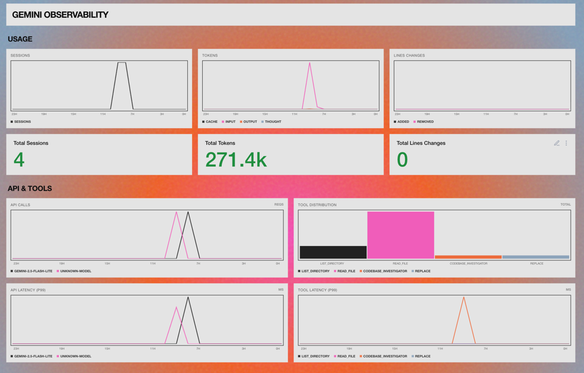
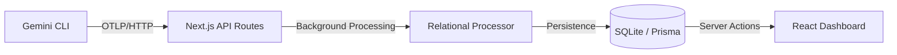

# Gemini CLI Observability Dashboard



A local-first observability solution for the [Gemini CLI](https://geminicli.com/). This dashboard enables developers to debug agent tool calls, monitor performance, and track LLM costs in real-time without external infrastructure.

This project implements a local collector for the telemetry data exported by Gemini CLI as described in the [official telemetry documentation](https://geminicli.com/docs/cli/telemetry/).

---

## Table of Contents
- [Core Features](#core-features)
- [Architecture](#architecture)
- [Quick Start](#quick-start)
- [Connecting Gemini CLI](#connecting-gemini-cli)
- [Project Structure](#project-structure)
- [License](#license)

---

## Core Features

- **OTLP Ingestion:** Built-in OpenTelemetry collector compatible with Gemini CLI's OTLP/HTTP export mode.
- **Trace Waterfall Viewer:** Interactive visualization of agent execution paths, highlighting `tool.execute` spans and their nested structures.
- **Cost Estimation:** Real-time cost tracking for Gemini models (1.5 Pro, 1.5 Flash, etc.) based on token usage.
- **Usage Analytics:** Daily token consumption trends and model performance metrics.
- **Local Persistence:** Powered by SQLite and Prisma for zero-config local data storage.

---

## Architecture

The dashboard acts as a self-contained OpenTelemetry backend using Next.js:



---

## Quick Start

### Option 1: Docker (Recommended)

**Run with Pre-built Image:**
```bash
docker run -d \
  --name gemini-observability \
  -p 4318:4318 \
  -v ./data:/app/data \
  feifeifeimoon0/gemini-observability:latest
```

**Or Build and Run from Source:**
```bash
docker build -t gemini-observability .
```

### Option 2: Node.js (npm/pnpm/yarn)

**Prerequisites:** Node.js 20+

1. **Clone and Install:**
   ```bash
   git clone https://github.com/feifeifeimoon/gemini-observability.git
   cd gemini-observability
   npm install
   ```

2. **Initialize Database:**
   ```bash
   npx prisma db push
   ```

3. **Start the Dashboard:**
   ```bash
   npm run dev
   ```
   The dashboard will be available at [http://localhost:4318](http://localhost:4318).

---

## Connecting Gemini CLI

While Gemini CLI supports simple file-based logging by default, this dashboard requires an **Advanced local telemetry setup** using the OTLP protocol.

### Configuration

Add or update the following in your `.gemini/settings.json` file (typically located in your home directory or project root):

```json
{
  "telemetry": {
    "enabled": true,
    "target": "local",
    "otlpEndpoint": "http://localhost:4318/api/otlp",
    "otlpProtocol": "http"
  }
}
```

For more details on these settings, refer to the [Gemini CLI Telemetry Docs](https://geminicli.com/docs/cli/telemetry/).

### Verification
Once configured, run any command to see the trace appear in the dashboard:
```bash
gemini -p "Explain how OTLP works"
```

---

## Project Structure

```text
├── src/
│   ├── app/                # Next.js App Router (Pages & API)
│   │   ├── api/otlp/       # OTLP Ingestion endpoints
│   │   └── sessions/       # Session Detail & Waterfall views
│   ├── components/         # UI components (Charts, Trace Trees)
│   ├── lib/
│   │   ├── telemetry/      # OTLP Processor & Cost Logic
│   │   └── db.ts           # Prisma Client
└── prisma/
    └── schema.prisma       # Database schema
```

---

## License

Distributed under the MIT License. See `LICENSE` for more information.
