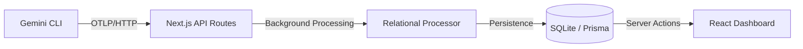

# Gemini CLI Observability Dashboard

A local-first observability solution for the [Gemini CLI](https://geminicli.com/). This dashboard enables developers to debug agent tool calls, monitor performance, and track LLM costs in real-time without external infrastructure.

This project implements a local collector for the telemetry data exported by Gemini CLI as described in the [official telemetry documentation](https://geminicli.com/docs/cli/telemetry/).

---

## Table of Contents
- [Core Features](#core-features)
- [Architecture](#architecture)
- [Quick Start](#quick-start)
- [Connecting Gemini CLI](#connecting-gemini-cli)
- [Project Structure](#project-structure)
- [Contributing](#contributing)
- [License](#license)

---

## Core Features

- **OTLP Ingestion:** Built-in OpenTelemetry collector compatible with Gemini CLI's OTLP/HTTP export mode for Traces, Metrics, and Logs.
- **Trace Waterfall Viewer:** Interactive visualization of agent execution paths, specifically optimized to highlight `tool.execute` spans and their nested structures.
- **Cost Estimation:** Real-time cost tracking for Gemini models (1.5 Pro, 1.5 Flash, etc.) based on token usage attributes.
- **Usage Analytics:** Daily token consumption trends and model performance metrics.
- **Local Persistence:** Powered by SQLite and Prisma for zero-config local data storage.
- **Adaptive UI:** Responsive dashboard design supporting both Light and Dark modes.

---

## Architecture

The dashboard acts as a self-contained OpenTelemetry backend using Next.js:



1. **Gemini CLI** exports telemetry using the standard OTLP/HTTP protocol.
2. **Next.js Backend** provides endpoints (`/v1/traces`, `/v1/metrics`, `/v1/logs`) to ingest JSON payloads.
3. **Data Processor** flattens nested OTEL spans into a relational schema optimized for LLM agent debugging.
4. **React Frontend** provides the interface for exploring session history and debugging tool calls.

---

## Quick Start

### Prerequisites
- Node.js 20+
- npm, pnpm, or yarn

### Installation

1. **Clone and Install:**
   ```bash
   git clone https://github.com/your-username/gemini-observability-dashboard.git
   cd gemini-observability-dashboard
   npm install
   ```

2. **Initialize Database:**
   ```bash
   npx prisma db push
   ```

3. **Start the Dashboard:**
   ```bash
   npm run dev
   ```
   The dashboard will be available at [http://localhost:4318](http://localhost:4318).

---

## Connecting Gemini CLI

Follow these steps to configure your Gemini CLI to export data to this local dashboard. For more details on these settings, refer to the [Gemini CLI Telemetry Docs](https://geminicli.com/docs/cli/telemetry/).

Run these commands in your terminal:

```bash
# 1. Enable telemetry
gemini settings set telemetry.enabled true

# 2. Set the target to local mode
gemini settings set telemetry.target local

# 3. Configure the OTLP endpoint (Next.js listens on port 4318)
gemini settings set telemetry.otlpEndpoint http://localhost:4318/api/otlp

# 4. Use HTTP protocol for maximum compatibility
gemini settings set telemetry.otlpProtocol http
```

### Verification
Run a simple command to trigger telemetry:
```bash
gemini -p "Verify observability setup"
```

---

## Project Structure

```text
├── src/
│   ├── app/                # Next.js App Router (Pages & API)
│   │   ├── api/otlp/       # OTLP Ingestion endpoints (Traces, Metrics, Logs)
│   │   └── sessions/       # Session Detail & Waterfall views
│   ├── components/         # UI components (Charts, Trace Trees, Layouts)
│   ├── lib/
│   │   ├── telemetry/      # OTLP Payload Processor & Cost Logic
│   │   └── db.ts           # Prisma Client Singleton
│   └── constants/          # Model rates and shared configuration
├── prisma/
│   ├── schema.prisma       # Database schema definition
└── docs/                   # Design specifications and implementation plans
```

---

## Contributing

Contributions are welcome. Whether it's adding new model rates, improving the trace visualization, or fixing bugs:

1. Fork the Project.
2. Create your Feature Branch (`git checkout -b feature/AmazingFeature`).
3. Commit your Changes (`git commit -m 'Add some AmazingFeature'`).
4. Push to the Branch (`git push origin feature/AmazingFeature`).
5. Open a Pull Request.

---

## License

Distributed under the MIT License. See `LICENSE` for more information.
